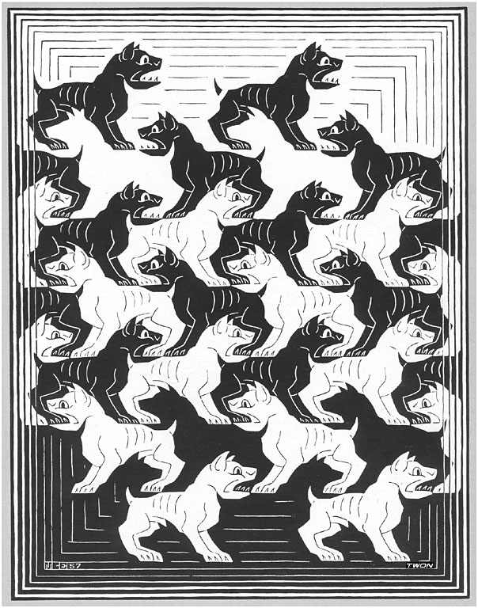

#   libdog: token-level revision control



libdog is a token-level revision control toolkit library.  It contains
various primitives, algorithms and data structures, including:

 0. source code *dogenizers* for about 60 languages,
 1. git compatibility utils: object and file formats, git's sync protocol,
 2. CRDT weave diff/merge/blame (RGA/CausalTree like),
 3. N.Fraser's diff cleanup,
 4. B.Cohen's patience diff,
 5. through its `libabc` dep, also Myers diff and other classic algos,
 6. through `libabc`, various on-disk formats (hashmaps, sorted sets, etc).
 7. many other things.

libdog is not "git reimplemented" like [libgit2][g] or [gitoxide][o].
That was not the objective here as git's commands and formats are
highly idiosyncratic legacy, to put that bluntly, and all of its
diff/merge/blame logic is line-based.  Meanwhile, git's object model
is very much an Internet-standard-level thing.  For that reason,
libdog contains all the necessary and performance-critical revision
control primitives that absolutely have to be implemented in a native
lib.  The size tells the story: [gitoxide][o] is about 270 KLoC of
Rust.  libdog's core is 14 KLoC of C, 24 counting its tests.  The
tokenizers are another 54 KLoC, but those are [Ragel][r] generated.

The revision control system per se uses all these primitives from a
safer environment. In particular, libdog [jab][j] bindings form the
foundation of [Beagle][B] the SCM system that is written in fully
malleable JavaScript.  This is similar to git's plumbing vs porcelain
division, but deeper.

libdog is written in ABC, a very minimalistic zero-alloc C dialect.


##  Tokenizers

Line-granular history is a historical accident of `diff(1)`. Rename
one variable and a line-based tool reports the whole line rewritten;
two people editing opposite ends of the same line get a conflict that
isn't one. libdog versions each language's native tokens. 60 languages
are supported. For unknown grammars it falls back to the generic-text
tokenizer. 

Each tokenizer is a hand-written Ragel scanner that classifies source
bytes into tagged tokens. The brilliance of Ragel is that there is no
parse tree, no allocation, and no dependencies. For example, the `C`
dogenizer can process 250MB/s on a laptop, which effectively means
tokenization is free for any practical purpose. That was in fact the
critical finding in applying CRDTs to the git data model: blobs can be
parsed on the fly, so all the [CausalTree][c] logic can be applied
transparently to very regular git blobs.

````sh
$ dogtok example.c
````
````
S	ok64
W	 
S	SumAll
P	(
S	u64s
W	 
S	a
P	)
W	 
P	{
W	\n    
S	u64
…
L	0
P	;
W	  
D	//
D	 
D	fold
````

###  Tag alphabet

A token is a `tok32`: a 5-bit tag, a display bit, a 2-bit diff side, a 24-bit
end offset. `THEME.h` paints the tags.

| Tag | Meaning                  | 
|-----|--------------------------|
| `D` | comment                  |
| `G` | string literal           |
| `L` | number literal           |
| `H` | preprocessor, annotation |
| `R` | keyword                  |
| `P` | punctuation              |
| `S` | default — identifiers    |
| `W` | whitespace               |
| `U` | URI — invisible click target |

A second pass (`tok/DEF.h`) enriches these with `N` for a defined name and
`C` for a call site; `F` marks a filename column.

###  Languages

60 dogenizers, dispatched by extension or by filename, for files whose name
is their type (`Makefile`, `Dockerfile`, `.gitignore`, `.clang-format`).
Unknown extensions fall back to the plain-text lexer rather than failing.

| Family        | Languages |
|---------------|-----------|
| Systems       | C `.c` `.h` · C++ `.cpp` `.cc` `.cxx` `.hpp` `.hh` `.hxx` · Go `.go` · Rust `.rs` · D `.d` · Zig `.zig` · Odin `.odin` · Solidity `.sol` · Verilog `.v` `.sv` · GLSL `.glsl` `.vert` `.frag` `.geom` `.comp` · LLVM IR `.ll` |
| JVM & .NET    | Java `.java` · Kotlin `.kt` `.kts` · Scala `.scala` `.sc` · C# `.cs` · F# `.fs` `.fsi` `.fsx` · Clojure `.clj` `.cljs` `.cljc` `.edn` |
| Scripting     | Python `.py` · JavaScript `.js` `.jsx` `.mjs` · TypeScript `.ts` `.tsx` · Ruby `.rb` · Perl `.pl` `.pm` · Lua `.lua` · PHP `.php` · Bash `.sh` `.bash` · PowerShell `.ps1` `.psm1` `.psd1` · R `.r` `.R` · Julia `.jl` |
| Functional    | Haskell `.hs` · OCaml `.ml` `.mli` · Elixir `.ex` `.exs` · Erlang `.erl` `.hrl` · Nim `.nim` `.nims` · Gleam `.gleam` · Agda `.agda` |
| Mobile        | Swift `.swift` · Dart `.dart` |
| Markup & web  | HTML `.html` `.htm` · CSS `.css` · SCSS `.scss` · LaTeX `.tex` `.sty` `.cls` · Typst `.typ` |
| Data & config | JSON `.json` · YAML `.yml` `.yaml` · TOML `.toml` · SQL `.sql` · GraphQL `.graphql` `.gql` · Protobuf `.proto` · HCL/Terraform `.hcl` `.tf` · Nix `.nix` |
| Build & ops   | CMake `.cmake` · Make `.mk` · Docker `.dockerfile` · VimL `.vim` · Fortran `.f90` `.f95` `.f03` `.f08` |
| Prose         | Markdown `.md` `.markdown` · StrictMark `.mkd` `.sm` · plain text `.txt` `.rst` |

Adding a language takes one `.c.rl` scanner, one keyword table, and one row in
`tok/TOK.c`. To regenerate a lexer after editing its scanner:

````sh
ragel -C tok/CT.c.rl -o tok/CT.rl.c -L
````

Generated output is committed, so building libdog does not require Ragel.


##  Build

Needs a C23 compiler, CMake 3.20+, and zlib.

````sh
git clone --recursive https://github.com/gritzko/libdog
cd libdog
cmake -B build -G Ninja
ninja -C build          # libdog.a and dogtok
ctest --test-dir build  # 23 test binaries
````

##  Modules

[INDEX.md][i] lists every module and function. Starting points:

- [DOG.md][d] the dog API, URI grammar, verb vocabulary, `.be` layout
- [ULOG.md][u] the event log format, on-disk and in-RAM
- [tok/DEF.md][def], [tok/BRCT.md][brct] definition marking, bracket matching
- [abc/README.md][a] the C dialect all of this is written in

[i]: ./INDEX.md
[d]: ./DOG.md
[u]: ./ULOG.md
[def]: ./tok/DEF.md
[brct]: ./tok/BRCT.md
[a]: ./abc/README.md
[o]: https://github.com/GitoxideLabs/gitoxide
[g]: https://libgit2.org/
[j]: https://github.com/gritzko/jab
[B]: https://github.com/gritzko/beagle
[r]: http://www.colm.net/open-source/ragel/
[c]: https://arxiv.org/pdf/2002.09511
